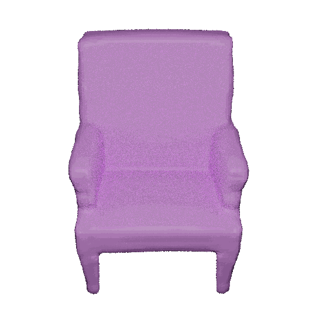
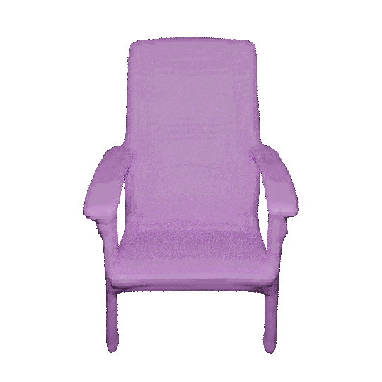
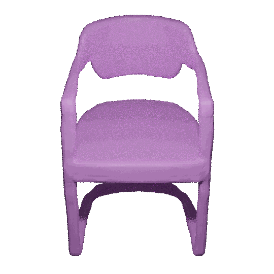
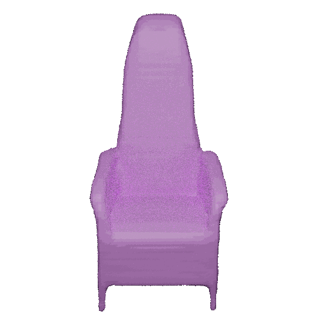
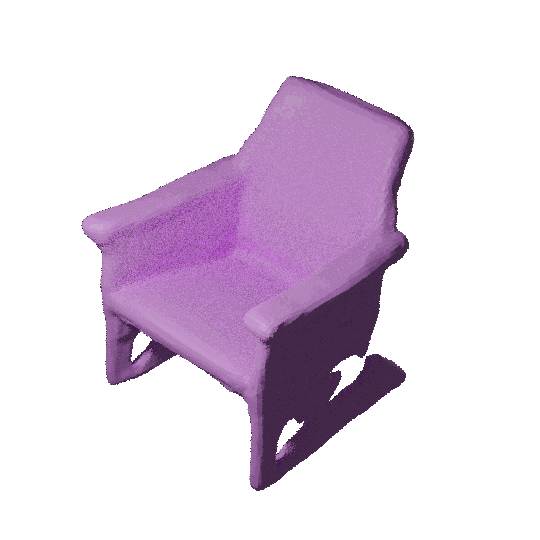
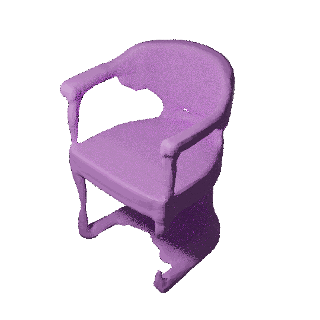

# 3D VR Sketch Guided 3D Shape Prototyping and Exploration (ICCV 2023)

## Introduction

3D shape modeling is labor-intensive and time-consuming and requires years of expertise. 
Recently, 2D sketches and text inputs were considered as conditional modalities to 3D shape generation networks to facilitate 3D shape modeling.  However, text does not contain enough fine-grained information and is more suitable to describe a category or appearance rather than geometry, while 2D sketches are ambiguous, and depicting complex 3D shapes in 2D again requires extensive practice.  Instead, we explore virtual reality sketches that are drawn directly in 3D. We assume that the sketches are created by novices, without any art training, and aim to reconstruct physically-plausible 3D shapes. Since such sketches are potentially ambiguous, we tackle the problem of the generation of multiple 3D shapes that follow the input sketch structure. Limited in the size of the training data, we carefully design our method, training the model step-by-step and leveraging multi-modal 3D shape representation. 
To guarantee the plausibility of generated 3D shapes we leverage the normalizing flow that models the distribution of the latent space of 3D shapes. 
To encourage the fidelity of the generated 3D models to an input sketch, we propose a dedicated loss that we deploy at different stages of the training process. We plan to make our code publicly available.

<!-- [](https://youtu.be/PCig106t7aM?si=h3bqDQAJqdbkBqE1&t=13  "3D VR Sketch Guided 3D Shape Prototyping and Exploration (ICCV 2023) 5 min" ) -->


[](https://youtu.be/PCig106t7aM?si=h3bqDQAJqdbkBqE1&t=13 "3D VR Sketch Guided 3D Shape Prototyping and Exploration (ICCV 2023) 5 min")


# Results

Generation results:

|1|2|3|4|
|:-:|:-:|:-:|:-:|
|||||

<!--  -->

Interpolation between multiple generation results:

|2|3|
|:-:|:-:|
|||


# Environments

# Dataset + Models

We provide the pre-trained models and datasets used in the paper for reproducing the results. You can unzip the file ([link](https://drive.google.com/drive/folders/10eYUtsZcCGSjj2H51EldFI5umXUmvUw0?usp=sharing)) in the ```3DSketch2Shape_data``` folder.

- ```models```:
  - ```stage1_decoder```: training DeepSDF in an auto-decoder way.
    - ```latent_code.pth```: Ground truth codes for each shape obtained from SDF decoder.
    - ```decoder_latest.pth```: SDF decoder checkpoint
    - ```encoder_latest.pth```: Point Cloud encoder checkpoint for shapes
  - ```stage1_AE```: stage 1 Autoencoder pretrained model
  - ```stage2_Gen```: stage 2 Generation model
- ```datasets```:
  - ```splits```: The dataset division used for the experiments.
  - ```pc```: 
    - ```sketch_pc_4096_{test,train}.npy```: the 3D sketch point cloud that aligned with SDF files. You can access the original VR sketch dataset here: [https://cvssp.org/data/VRChairSketch/](https://cvssp.org/data/VRChairSketch/). 
    - ```shape_pc_4096.npy```: shape point cloud. The collection of 6,576 chair shapes is sourced from ShapeNetCore v2.
  - ```sdf```: The SDF data for chair shapes can be obtained from [https://github.com/Yueeey/sketcch3D](https://github.com/Yueeey/sketcch3D). Please download the ```XXX.npz``` files to your path and revise the ```SDF_DATA_DIR``` in ```.env``` file as your path correspondingly.


# Note

You need to set all variables in  ```.env``` before running any commands below.

- ```DATA_DIR```: The directory path for the data including datasets and models. You can set it to the ```3DSketch2Shape_data``` path where you downloaded the data.
- ```EXP_DIR```: The directory where all experimental files are stored, including checkpoints, generated results, etc.

# Training

Begin by training the SDF decoder. Subsequently, train the sketch-to-shape autoencoder. Finally, load the pretrained autoencoder into the second stage generation model.

## Stage 1: SDF decoder

Train DeepSDF in auto-decoder manner to obtain the ground truth latent code for shapes.

This part of the code is still being organized.

## Stage 1: Autoencoder

```shell
python flow_sdf_trainer.py --resume_path configs/stage1_AE.py
```

## Stage 2: Generation model

```shell
python flow_sdf_trainer.py --mode train --resume_path configs/stage2_GenNF.py
```

# Testing/Inference

```shell
python flow_sdf_trainer.py --mode inference --resume_path configs/stage2_GenNF.py 
--resume_epoch 300
--num_gen 7 # 1(reconstruction result from shape) + 1(reconstruction result from sketch) + 5(the number of generated shapes conditioned on the sketch input)
```

# Rendering Results

Coming soon!


# Citation

If you find our work useful in your research, please consider citing:
```
@inproceedings{luo20233d,
  title={3D VR Sketch Guided 3D Shape Prototyping and Exploration},
  author={Luo, Ling and Chowdhury, Pinaki Nath and Xiang, Tao and Song, Yi-Zhe and Gryaditskaya, Yulia},
  booktitle={Proceedings of the IEEE/CVF International Conference on Computer Vision},
  pages={9267--9276},
  year={2023}
}

```


